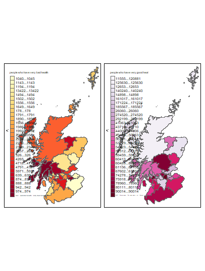
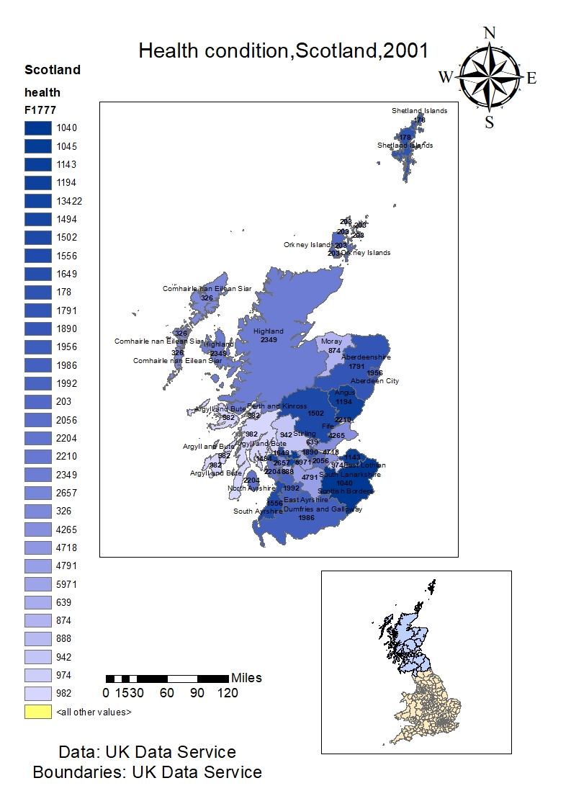

```{r}
install.packages("tidyverse")
library(tidyverse)
ScotlandData<-read.csv("N:\\jiangdu\\rproject1\\health\\ScotlandData.csv", header = TRUE, sep = ",")
class(ScotlandData)
datatypelist<-data.frame(cbind(lapply(ScotlandData,class)))
ScotlandData<-read.csv("N:\\jiangdu\\rproject1\\health\\ScotlandData.csv")
ScotlandData <- edit(ScotlandData)
rm(LondonData)
summary(df)
names(ScotlandData)
install.packages("maptools")
install.packages(c("classint", "OpenStreetMap", "tmap"))
install.package("RColorBrewer", "Sp", "rgeos", "tmap", "tmaptools", "sf", "downloader", "rgdal", "geojsonio")
library(maptools)
library(RColorBrewer)
library(classInt)
library(OpenStreetMap)
library(sp)
library(rgeos)
library(tmap)
library(tmaptools)
library(sf)
library(rgdal)
library(geojsonio)
ScotlandMapSF <- read_shape("BoundaryData2/scotland_ca_2010.shp", as.sf = TRUE)
qtm(ScotlandMapSF)
library(methods)
class(ScotlandMapSF)
ScotlandDataMap<- append_data(ScotlandMapSF,ScotlandData, key.shp = "code", key.data = "GEO_CODE", ignore.duplicates = TRUE)
tmap_mode("plot")
qtm(ScotlandDataMap, fill = "F1777")
install.packages("shinyjs")
library(shinyjs)
tmaptools::palette_explorer()
Scotland_osm <- read_osm(ScotlandDataMap, type = "esri", zoom = NULL)
qtm(Scotland_osm) + 
  tm_shape(ScotlandDataMap) + 
  tm_polygons("F1777", 
              style="jenks",
              palette="YlOrRd",
              midpoint=NA,
              title="numberof people ",
              alpha = 0.5) + 
  tm_compass(position = c("right", "bottom"),type = "arrow") + 
  tm_scale_bar(position = c("right", "bottom")) +
  tm_layout(title = "people who have very bad health", legend.position = c("left", "bottom"))

tm_shape(ScotlandDataMap) +
    tm_polygons(c("F1777", "F1779"),
        style=c("jenks", "pretty"),
        palette=list("YlOrRd", "PuRd"),
        auto.palette.mapping=FALSE,
        title=c( "people who have very bad health","people who have very good health"))
```
This article compares the advantages and disadvantages of two commonly used software for GIS，ArcMap and R, which are based on GUI and code separately.
ArcMap is GUI-based software, which highlight interaction with the user and focus on how users feel.  To be more specific, the graphical user interface makes it is possible for users to interact with electronic devices through graphical and visual tools, rather than pure text-based user interfaces or typed command lines. Compared with GUI-based software, some users are likely to have difficulty in understanding the command in R. However, R can help users improve work efficiency and save working time. Since all data is processed by code, it is convenient to copy the command and perform the same operation on other similar data sets, while users have to repeat these stages again in ArcMap, which means they have more risk to make mistakes. There is another problem in R need to be mentioned, when users install the package from ecosystem, there may have some errors. For example, some packages cannot be installed successfully in a different version of R.
When it comes to the way to explore data and store them in ArcMap, considering the flexibility of geographic database, users need to create geodatabase at the beginning. It can store attribute information of map as a folder in file system to link to spatial data. The way of data view is also different. If users want to check the data, they need to open attributable table of each layer, the normal way to recognize the layers is from top to bottom. The data in R is listed in the environment, it is convenient to open the file when we need. A user can open several sets of data at the same time and compare them clearly and intuitively.
Next comes to the way of layout. Both ArcMap and R allow the user to create multiple data frames within one table of contents, users can view them in a single data frame at a time. In addition, users will be able to obtain much effective information through changing the attributes of maps quickly. For example, a user can execute “tmap”,”tmaptool” mode in R directly after install these packages, or change symbology of map’s properties in ArcMap to create a choropleth map. 
It is a truth that users may prefer to choose R when they face some complex data, considering the convenience of  using the command to analyse data in R, while the file of data need to be edited to modify errors before being loaded into ArcMap. In R, users can summarise the data easily to examining the data by using “summary” function. However, ArcMap only has some basic analytic function, such as rank data. In addition, we can obtain the relationship between two groups of data through the plot of them. Furthermore, it is possible to produce many kinds of maps in R, not only maps. 
In conclusion, both R and ArcMap are great tools to produce maps which contain many attributes in an easy and convenient way. For those who did not learn any R language, they may prefer to choose ArcMap, while for those who deal with similar data, they are more likely to use R, since it is meaningless to repeat same stages.



